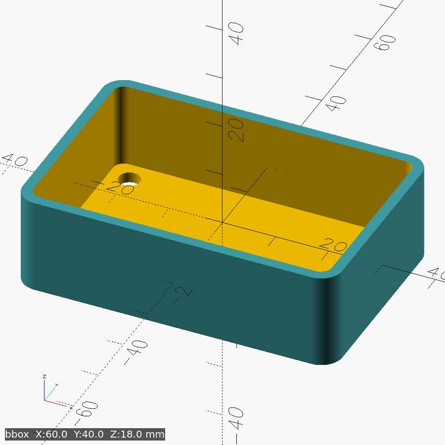

# demo-tray

A parametric rounded tray with a hollow cavity and four corner mounting holes —
the starter example for this repo, exercising BOSL2 rounding, `diff()`/`tag()`,
and attachment-based placement.

**Key params:** width=60, depth=40, height=18, wall=2, fillet=4, hole_d=4, hole_inset=6 (mm)

**Print:** open face up (as modelled), 0.2 mm layers, no supports (all overhangs ≤ 45°).

