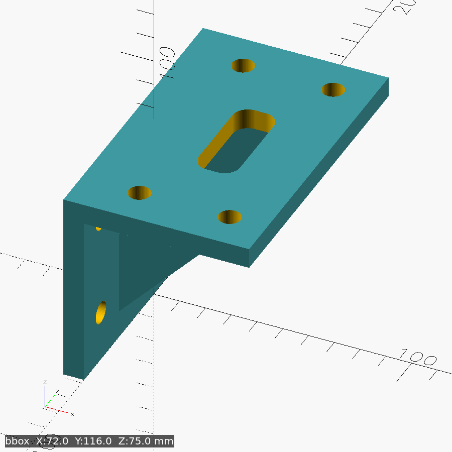

# ebrake-bracket

Gusseted L-bracket that mounts a generic USB hall-effect handbrake
([bought as "Laroal 64 Bit"](https://www.amazon.de/-/en/dp/B0F17VZ6LT) —
canonically an [ODDOR handbrake](https://www.aliexpress.com/store/1103335664))
to the inner vertical face of a GT Omega PRIME Lite 8040 side rail — handbrake upright on the shelf,
lever pulling straight back toward the seat. Symmetric in Y, so it fits either
side of the rig. The proof-of-concept print bolted up to both the rail and the
handbrake as-is.

**Key params (mm):** `leg_h=75` (shelf height — *the* tuning knob for shifter
clearance) · plate holes `bp_hole_d=8.5` (M8) @ 86×35 c-c, measured ·
rail bolts @ y=±44, z=20/60 (the 80 mm face T-slots) · `plat_th=8`, `leg_th=8`,
gussets 52×56×6. Envelope 72 × 116 × 75.

**Hardware:** 4× M8 + nut underneath (handbrake → shelf), 4× M8 + T-nut
(leg → rail). The upper rail-bolt row sits 7 mm under the shelf — socket heads
fit, 16 mm washers don't.

**Print:** rail face on the bed, for the fit-check *and* the final part — it's
support-free, and layers stack inboard (X) so the pull (−Y) and the part's
weight (−Z) load every layer in-plane rather than across the layer bond. (The
PoC spec's "print on its side" advice was backwards: a Y face down puts the
pull in pure inter-layer tension.) Fit-check: 0.28 mm layers, 15 % gyroid.
Load-bearing: PETG/ASA, ≥4 walls, 40–50 % infill. FDM holes shrink — add
~0.1 mm X-Y hole compensation if the M8 bolts bind.

Measured interfaces, coordinate frame, and verified clearances: [SPEC.md](SPEC.md).

