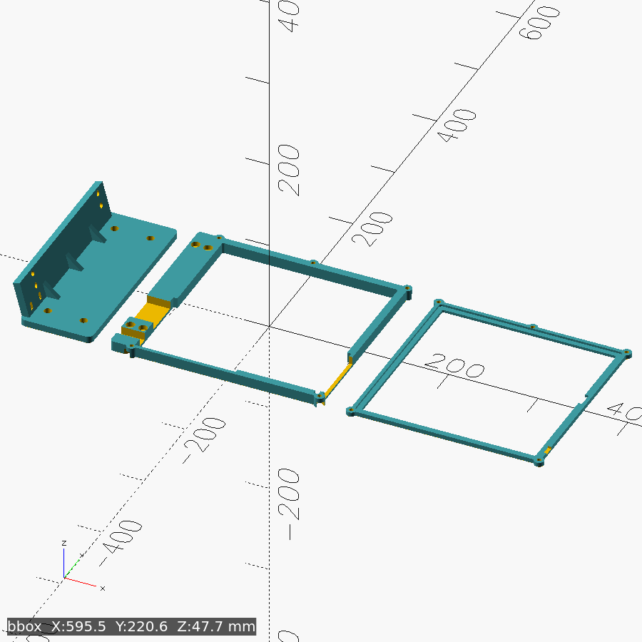

# uniflag

Mount for a Pimoroni Cosmic Unicorn (32×32 LED matrix running
[uniflag](https://github.com/nickolaj-jepsen/uniflag) as a SimHub virtual
flag) on the outboard face of the right wheel-deck upright of a GT Omega
PRIME Lite (8040 profile). Screen faces the driver, yawed 25° toward the
seat. Three print bodies in one STL (`part="plate"` default — split objects
in the slicer); design rationale and DXF-exact board data in
[SPEC.md](SPEC.md) and [docs/](docs/).

**Parts:** `bracket` (rail plate + short leaning wall), `frame` (rear ring
the board drops into, extended into a flat M5 bolt flange), `ring` (front
clamp ring; sensor window in the left lip). Render/verify one body
with `scad render uniflag --tag frame -D 'part="frame"'`; `part="assembly"`
shows the fit, `part="collide"` must render empty.

**Key params:** `gap=42` (rail → board edge, fits the 30 mm micro-B boot),
`yaw=25`, `chan_slack=0.35` (board float), `bd_clr=0.4`,
`usb_y`/`btnl_y`/`btnr_y` (edge windows), `m5_rows`/`col_sp` (flange bolt
grid), `m8_y` rows, `board_y0`.

**Hardware:** 4× M8×14 + T-nuts (rail), 4× M5×30 + washers + nuts (flange →
wall; socket heads sink into flange counterbores, nuts on the monitor side),
5× M4×14 + nuts (ring → frame; nuts drop into the back-opening pockets).

**Assembly:** bracket to the rail with M8s, slide to height, tighten →
**M4 nuts into the frame's back pockets first** (the wall covers the
bottom-left pocket once mounted) → frame onto the wall, M5×30s through the
front counterbores, washer + nut behind the wall (before the board goes in —
the ring overlaps the counterbore mouths) → board into the frame → ring on,
M4s from the front. Zip-tie the USB cable through the wall-foot slots below
the plug tunnel.

**Print (Bambu A1):** all bodies lie print-ready in the plate — bracket
rail-face down (25° wall is self-supporting, M5 bores teardropped), frame
back-face down (notches open upward), ring front-face down. PETG (the A1 is
open-frame — ASA will warp at this footprint), 0.2 mm layers, ≥4 walls,
40–50 % infill, **no supports**; no bridges beyond trivial spans (nut-pocket
floors, zip-slot ceilings). Use a 5 mm brim on the frame
and ring and a textured PEI sheet against corner lift; the bracket plate's
big rounded corners + elephant-foot chamfer are the warp relief.

